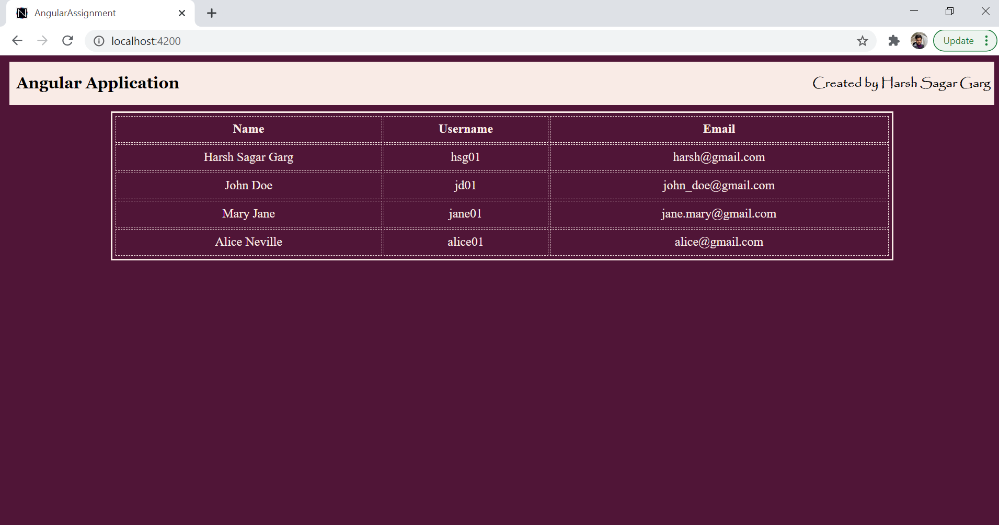
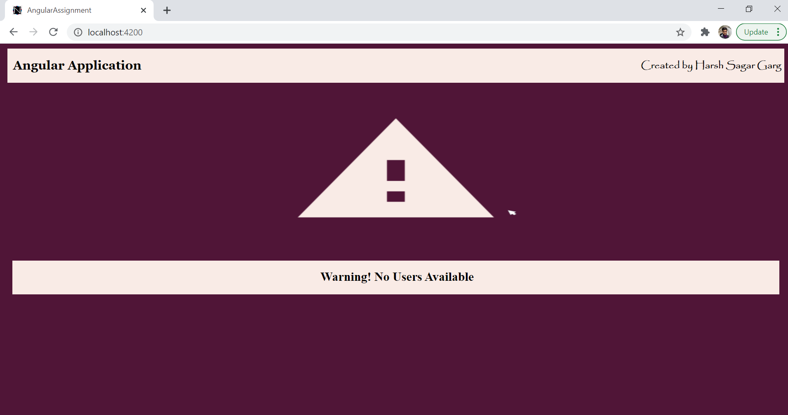

# Nagrro-Angular-Assignment:

* Yellow Background for email

* Listing issues in a Github Repository of a user.

## Getting Started

* Download the zip file
* Open Project in VS Code or any code editor and run the following commands
* cd Ng-Angular-Assignment
* npm install
* ng serve
